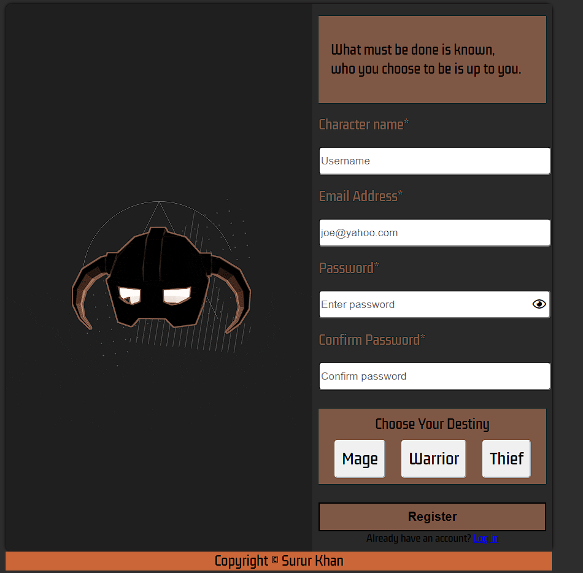

# Login Page
→ [Live Demo](https://rukhan4.github.io/signup-form/index)

## Table of contents
* [Description](#description)
* [Technologies](#technologies)
* [Setup](#setup)
* [Live Example](#live)

## Description
This project entails a login page that validates inputted data by utilizing jQuery and the Javascript Validation API. It is further styled with CSS Flexbox.
	
## Technologies
Project is created with:
* Javascript 1.7 (chrome)
* HTML5
* CSS3  
* jQuery
* Validation API
	
## Setup
To run this project, install it locally as shown:

Click the ``fork`` button in this repository. This allows the user to create a remote repository in their Github. In order to modify this project:

1) Copy the Git repository URL for your new Fork

2) On the terminal, in your project directory, add a remote:

``git remote add fork <repo-fork-url>``

3) Ensure your fork is up-to-date in relation to the original project

```git checkout master```

```git pull -rebase origin master```

4) Remove the existing upstream for master; Setup upstream to publish your commits to your Fork

```git branch --unset-upstream master```

```git push -u fork master```

## Live

